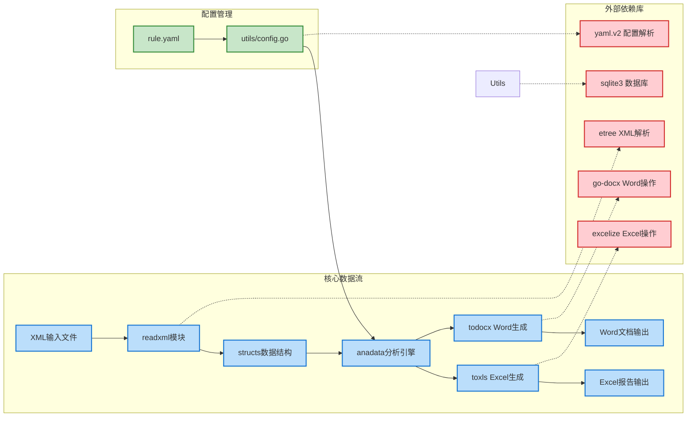
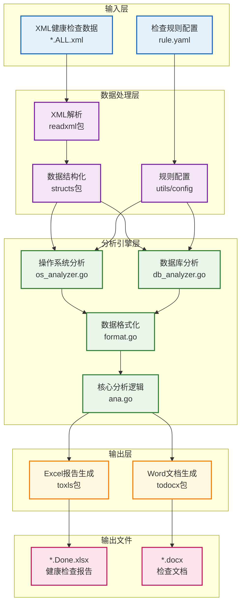

# Autochk
健康检查自动分析系统 Version 3.0

# 功能 
这是一个名为 `autochk` 的Go语言项目，主要功能是分析Oracle数据库和操作系统的健康检查数据。项目从XML文件中读取数据，进行分析处理，然后根据模版生成Excel报告。

## 主要特性总结

1. **项目类型**: Oracle数据库和操作系统健康检查分析工具
2. **主要功能**: 
   - XML数据解析和结构化
   - 基于规则的自动化分析
   - 多格式报告生成（Excel + Word）
3. **核心模块**:
   - `readxml`: XML数据读取和解析
   - `structs`: 数据结构定义
   - `anadata`: 分析引擎核心
   - `toxls`: Excel报告生成
   - `todocx`: Word文档生成
   - `utils`: 配置管理和工具函数
4. **外部依赖**: 使用了etree、excelize、go-docx等专业库
5. **配置驱动**: 通过rule.yaml文件定义检查规则和阈值

# 项目架构:

main.go：负责参数解析 → XML 合并 → 循环处理每组 R/S XML  ,每组执行链：  readxml → anadata → toxls → 日志输出

anadata：依据规则（rule.yaml）对 Sheet 进行检查，生成告警标记与 SummaryEntries

toxls：使用 excelize 将结果写入模板 xlsx


|--main.go	程序总入口,调度readxml读取xml,调度anadata分析xml内容,调度toxls写入xlsx文件;
|
|-structs/structs.go 定义了InfoSht,OsSht,DbSht三个structs,分别对应"展现结构体","系统结构体","数据库结构体";
|
|-readxml/readxml.go 读取给定的xml文件,遍历tag标签,提取出每个检查项目及内容,分类保存到infoshtp,osshtp,dbshtp三个struct中;
|
|-anadata /：对检查项根据规则进行分析
|
|-toxls/xlsx.go 将经过anadata 包分析后的InfoSht,OsSht,DbSht三个structs内容,格式化写入到xlsx文件中;
|
|-utils/config.go 解析yaml文件获得检查项及健康判定规则;
|
|-rule.yaml  健康检查规则文件;


## 项目结构和依赖关系分析

```mermaid
graph TB
    %% 主程序入口
    Main[main.go<br/>主程序入口] --> ReadXML[readxml包<br/>XML数据读取]
    Main --> Structs[structs包<br/>数据结构定义]
    Main --> ToXLS[toxls包<br/>Excel报告生成]
    Main --> ToDocx[todocx包<br/>Word文档生成]
    
    %% 配置和工具
    Main --> Utils[utils包<br/>工具函数和配置]
    Utils --> RuleYAML[rule.yaml<br/>检查规则配置]
    Utils --> ConfigGo[config.go<br/>YAML配置解析]
    Utils --> DBGo[db.go<br/>数据库操作]
    Utils --> UtilsGo[utils.go<br/>通用工具函数]
    
    %% 数据分析模块
    AnaData[anadata包<br/>数据分析引擎] --> Structs
    AnaData --> Utils
    AnaData --> Analyzer[analyzer.go<br/>分析协调器]
    AnaData --> OSAnalyzer[os_analyzer.go<br/>OS指标分析]
    AnaData --> DBAnalyzer[db_analyzer.go<br/>DB指标分析]
    AnaData --> Format[format.go<br/>数据格式化]
    AnaData --> Ana[ana.go<br/>核心分析逻辑]
    
    %% 数据结构
    Structs --> InfoSht[InfoSht<br/>基础信息结构]
    Structs --> OsSht[OsSht<br/>操作系统数据结构]
    Structs --> DbSht[DbSht<br/>数据库数据结构]
    Structs --> SummaryEntries[SummaryEntries<br/>汇总报告结构]
    
    %% XML读取模块
    ReadXML --> ETree[github.com/beevik/etree<br/>XML解析库]
    ReadXML --> Structs
    
    %% Excel生成模块
    ToXLS --> Excelize[github.com/xuri/excelize/v2<br/>Excel操作库]
    ToXLS --> Structs
    ToXLS --> Utils
    
    %% Word文档生成模块
    ToDocx --> GoDocx[github.com/lukasjarosch/go-docx<br/>Word文档库]
    ToDocx --> Structs
    
    %% 外部依赖
    Utils --> YAML[gopkg.in/yaml.v2<br/>YAML解析库]
    Utils --> SQLite[github.com/mattn/go-sqlite3<br/>SQLite数据库]
    
    %% 输入输出文件
    XMLFiles[*.ALL.xml<br/>输入XML文件] --> ReadXML
    ToXLS --> ExcelFiles[*.Done.xlsx<br/>输出Excel报告]
    ToDocx --> WordFiles[*.docx<br/>输出Word文档]
    
    %% 样式定义
    classDef mainModule fill:#e1f5fe,stroke:#01579b,stroke-width:2px
    classDef dataModule fill:#f3e5f5,stroke:#4a148c,stroke-width:2px
    classDef utilModule fill:#e8f5e8,stroke:#1b5e20,stroke-width:2px
    classDef outputModule fill:#fff3e0,stroke:#e65100,stroke-width:2px
    classDef externalLib fill:#fce4ec,stroke:#880e4f,stroke-width:2px
    classDef fileType fill:#f1f8e9,stroke:#33691e,stroke-width:2px
    
    class Main mainModule
    class Structs,ReadXML,AnaData dataModule
    class Utils,ConfigGo,DBGo,UtilsGo utilModule
    class ToXLS,ToDocx outputModule
    class ETree,Excelize,GoDocx,YAML,SQLite externalLib
    class XMLFiles,ExcelFiles,WordFiles,RuleYAML fileType
```



## 详细的模块依赖关系图



## 项目功能架构图




## 填加指标步骤:

1. 确定标签, chk shell增加收集命令 (要确定标签所属位置是TAG0(os层),TAG1(DB层)还是TAG2(inst层)?

2. rule.yaml 增加指标说明和阀值

3. 在config.go中填加yaml的解析映射 (2处)

4. 在stucts.go中填加type 

5. 在xlsx模板中填入指标标签(区分basic,deep)  公式,名称管理

6. 在readXml.go processTag0Node或processTag1Node相应位置添加解析 (2处)

7. 在分析函数中增加指标分析,在analyzer中添加调用

说明:

1. rule.yaml注意":"后要有空格如  nm: value

2. 如果是检查指标,在confg中添加检查规则名称, 要和yaml完全一致, 注意数据类型

# 编译和发布

完成代码改动-> 更新Readme.md-> commit -> tag->push

```
# 1. 添加变更
git add .

# 2. 提交变更
git commit -m "提交说明"

# 3. 创建新的 tag
    ##先查看本地当前tag
    git tag -l
    ##查看源端tag
    git ls-remote --tags origin
    ## 打版本
    git tag v2509.4

# 4. 推送代码及版本到远程仓库
git push 
git push origin v2509.4
```

```
#删除本地错误 tag
git tag -d v1.2.0
#删除远程错误 tag
git push origin :refs/tags/v1.2.0
```


```
##windows
go build -ldflags="-s -w" -o autochk.exe main.go

##linux  ,在Windows上编译Linux版本时禁用CGO
set GOOS=linux
set GOARCH=amd64
set CGO_ENABLED=0
go build -ldflags="-s -w" -o autochk main.go
```


###  调试
打开调试打印: set AUTOCHK_LOG_LEVEL=debug|warn|info  
关闭: set AUTOCHK_LOG_LEVEL= 

# Bug List
关于3.3.18序列最大值使用检查这一块的，当MAXVALUE为0时查询语句select sequence_owner,sequence_name, max_value,last_number,cache_size,round(last_number/max_value ,2) percent_use from dba_sequences 
where  last_number/max_value >0.8 and  cycle_flag='N'会报错ORA-01476: divisor is equal to zero，看看要不要加上max_value<>0


确认“最多4节点 + 模板压缩”策略
完整占位符清单
1. 节点相关占位符（每个节点一组，最多4个节点）
OS字段（每节点一组）：
{NODE1_NODEID}, {NODE1_HOSTNAME}, {NODE1_IPADDR}, {NODE1_OS}, {NODE1_RELVER}
{NODE1_CPU_MODEL}, {NODE1_CPUCOUNT}, {NODE1_CPUMHZ}, {NODE1_MEMTOTAL}, {NODE1_SWAPTOTAL}
{NODE1_OSPARAMETER}, {NODE1_ULIMIT}, {NODE1_OSLOG}, {NODE1_FILESYSTEM}, {NODE1_INODEUSAGE}
{NODE1_CPUSTAT}, {NODE1_MEMSTAT}, {NODE1_IOSTAT}, {NODE1_THPSTAT}, {NODE1_HUGPAGE}
{NODE1_NUMA}, {NODE1_NTP}, {NODE1_TMZONE}, {NODE1_SELINUX}, {NODE1_FIREWALL}
{NODE1_NSSWITCH}, {NODE1_LO_MTU}, {NODE1_MACHINE_PLATFORM}, {NODE1_CPU_PERF_MODE}
{NODE1_NOZEROCONF}, {NODE1_RPM_PACKAGES}
实例字段（每实例一组）：
{INST1_INSTNAME}, {INST1_LOADPROFILE}, {INST1_INSTEFFICIENCY}, {INST1_TOPEVENT}
{INST1_TOPSQL_BY_ELA}, {INST1_CURSOR_SHARE_MEM}, {INST1_DBRESOURCE}, {INST1_DBPSU}
{INST1_DBPATCH}, {INST1_DBLSNRINFO}, {INST1_DBPARAMETER}, {INST1_DB_PARAMETER_FILE}
{INST1_DBREDOCHECK}, {INST1_DBREDOSWITCH}, {INST1_RECOVERY_USAGE}, {INST1_RECOVERY_DETAIL}
{INST1_DBERRLOG}, {INST1_DBDGLAGCHECK}, {INST1_DBDGERRCHECK}
节点2-4的字段： 将上述 NODE1_* 和 INST1_* 替换为 NODE2_*, NODE3_*, NODE4_* 和 INST2_*, INST3_*, INST4_*
2. 全局占位符
节点数量：
{NODE_COUNT} - 实际节点数量
数据库信息：
{DBNAME}, {DBMAA}, {DBVER}, {DBSTATUS}, {DBLANG}, {LOGMODE}, {FLASHBACK}
{DBCURSIZE}, {DBF_SIZE}, {DBF_CNT}, {DBF_STAT}, {TMPFILE_SIZE}, {DBTBLCOUNT}
{DBROLE}, {DBTBSUSAGE}, {DBCONTROLFILE}, {USER_INFO}, {USER_SIZE}
{TAB_INFO}, {TAB_PARALLEL}, {INX_PARALLEL}, {INVALID_OBJ}, {INVALID_INX}
{DBSEQUENCE}, {DB_SEQ_USAGE}, {DBOPTION}, {DBFEATURES}, {DB_EXPIR_USER}
{DB_PASSWORD_VERIF}, {DBDBAPRIV}, {DBSYSDBA}, {DBAUDITSEGMENT}, {DBAUDITCONT}
{DB_NOSYS_IN_SYSTEM}, {USERFAILEDLOGIN}, {DBVIRSCHECK}, {DBSCNHEALTHCHECK}
{DBRMANCHECK}, {CRS_STAT}, {CRS_STAT2}, {OCR_INFO}, {OCR_BAK_CHECK}
{ASM_USAGE}, {ASM_OFFSET}
特殊字段：
{RPTDATE} - 报告生成日期 (yyyy-mm-dd)
{PROJECTNAME} - 项目名称
兼容字段（使用第一个节点数据）：
{HOSTNAME}, {NODEID}, {IPADDR}, {OS}, {RELVER}, {CORES}, {CPUCOUNT}, {CPUMHZ}
{MEMTOTAL}, {SWAPTOTAL}, {OSPARAMETER}, {ULIMIT}, {OSLOG}, {FILESYSTEM}
{INODEUSAGE}, {CPUSTAT}, {MEMSTAT}, {IOSTAT}, {THPSTAT}, {HUGPAGE}
{NUMA}, {NTP}, {TMZONE}, {SELINUX}, {FIREWALL}, {NSSWITCH}, {LO_MTU}
{MACHINE_PLATFORM}, {CPU_PERF_MODE}, {NOZEROCONF}, {RPM_PACKAGES}
模板设计建议
2node.docx 模板
预留 NODE1_* 和 NODE2_* 占位符
预留 INST1_* 和 INST2_* 占位符
节点2的行设置为最小行高，段前后距为0
4node.docx 模板
预留 NODE1_* 到 NODE4_* 占位符
预留 INST1_* 到 INST4_* 占位符
节点3-4的行设置为最小行高，段前后距为0
现在程序已经支持多节点模板切换，你可以准备这两个模板文件了！


### 增加ssh节点
```
在WIn  powershell:
cat ~/.ssh/id_rsa.pub 
复制其内容:
ssh-rsa AAAAB3NzaC1yc2EAAAADAQABAAABgQC+t+Z1AiS ... . ail.com

ssh oracle@1.1.1.112
vi  ~/.ssh/authorized_keys
粘贴在最后

测试 ssh oracle@1.1.1.112 date
```


## 版本管理
```
git tag v2509.0
git push origin v2509.0      # 推到远端，供其他人/流水线使用
```
发布流程（以后每次都一样）:

1. 完成代码改动，更新 CHANGELOG.md。
2. 决定下一个版本号（先拉 tag 列表）。
```
查看本地tag
git tag -l
查看源端tag
git ls-remote --tags origin
```
3. 执行：
```
   git tag v<新版本>
   git push origin v<新版本>
   运行 build.bat
````
或者:
```
git tag v2509.0 && git push --tags
build.bat
```
生成：


需要再次提交tag
```
   git tag -d v2509.0
   git push origin :refs/tags/v2509.0   # 删除远端同名 tag
   git tag v2509.0                      # 重新打
   git push origin v2509.0
```


# FYI

##  使用 etree 解析复杂结构的 xml 文件

参考如下
https://godoc.org/github.com/beevik/etree
https://pkg.go.dev/github.com/beevik/etree?tab=doc
https://github.com/beevik/etree
