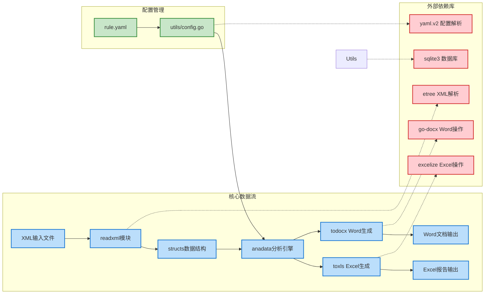
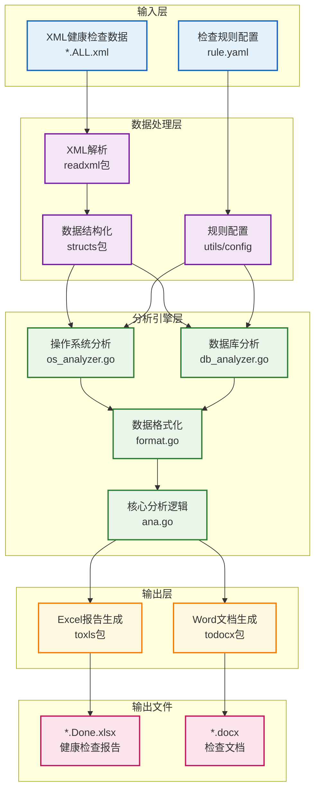

anadata 包：

analyzer.go：分析主入口，协调格式化、OS 和 DB 指标分析

format.go：格式化 InfoSht 字段

os_analyzer.go：OS 指标分析

db_instance.go：实例状态和存储分析

db_performance.go：性能和效率分析

db_security.go：安全检查

db_objects.go：数据库对象管理

db_monitoring.go：错误监控、DataGuard、备份及杂项分析

基于我对项目代码库的分析，我现在可以为您创建一个详细的Mermaid图表来展示项目结构和依赖关系。

## 项目结构和依赖关系分析

这是一个名为 `autochk` 的Go语言项目，主要功能是分析Oracle数据库和操作系统的健康检查数据。项目从XML文件中读取数据，进行分析处理，然后生成Excel报告和Word文档。

```mermaid
graph TB
    %% 主程序入口
    Main[main.go<br/>主程序入口] --> ReadXML[readxml包<br/>XML数据读取]
    Main --> Structs[structs包<br/>数据结构定义]
    Main --> ToXLS[toxls包<br/>Excel报告生成]
    Main --> ToDocx[todocx包<br/>Word文档生成]
    
    %% 配置和工具
    Main --> Utils[utils包<br/>工具函数和配置]
    Utils --> RuleYAML[rule.yaml<br/>检查规则配置]
    Utils --> ConfigGo[config.go<br/>YAML配置解析]
    Utils --> DBGo[db.go<br/>数据库操作]
    Utils --> UtilsGo[utils.go<br/>通用工具函数]
    
    %% 数据分析模块
    AnaData[anadata包<br/>数据分析引擎] --> Structs
    AnaData --> Utils
    AnaData --> Analyzer[analyzer.go<br/>分析协调器]
    AnaData --> OSAnalyzer[os_analyzer.go<br/>OS指标分析]
    AnaData --> DBAnalyzer[db_analyzer.go<br/>DB指标分析]
    AnaData --> Format[format.go<br/>数据格式化]
    AnaData --> Ana[ana.go<br/>核心分析逻辑]
    
    %% 数据结构
    Structs --> InfoSht[InfoSht<br/>基础信息结构]
    Structs --> OsSht[OsSht<br/>操作系统数据结构]
    Structs --> DbSht[DbSht<br/>数据库数据结构]
    Structs --> SummaryEntries[SummaryEntries<br/>汇总报告结构]
    
    %% XML读取模块
    ReadXML --> ETree[github.com/beevik/etree<br/>XML解析库]
    ReadXML --> Structs
    
    %% Excel生成模块
    ToXLS --> Excelize[github.com/xuri/excelize/v2<br/>Excel操作库]
    ToXLS --> Structs
    ToXLS --> Utils
    
    %% Word文档生成模块
    ToDocx --> GoDocx[github.com/lukasjarosch/go-docx<br/>Word文档库]
    ToDocx --> Structs
    
    %% 外部依赖
    Utils --> YAML[gopkg.in/yaml.v2<br/>YAML解析库]
    Utils --> SQLite[github.com/mattn/go-sqlite3<br/>SQLite数据库]
    
    %% 输入输出文件
    XMLFiles[*.ALL.xml<br/>输入XML文件] --> ReadXML
    ToXLS --> ExcelFiles[*.Done.xlsx<br/>输出Excel报告]
    ToDocx --> WordFiles[*.docx<br/>输出Word文档]
    
    %% 样式定义
    classDef mainModule fill:#e1f5fe,stroke:#01579b,stroke-width:2px
    classDef dataModule fill:#f3e5f5,stroke:#4a148c,stroke-width:2px
    classDef utilModule fill:#e8f5e8,stroke:#1b5e20,stroke-width:2px
    classDef outputModule fill:#fff3e0,stroke:#e65100,stroke-width:2px
    classDef externalLib fill:#fce4ec,stroke:#880e4f,stroke-width:2px
    classDef fileType fill:#f1f8e9,stroke:#33691e,stroke-width:2px
    
    class Main mainModule
    class Structs,ReadXML,AnaData dataModule
    class Utils,ConfigGo,DBGo,UtilsGo utilModule
    class ToXLS,ToDocx outputModule
    class ETree,Excelize,GoDocx,YAML,SQLite externalLib
    class XMLFiles,ExcelFiles,WordFiles,RuleYAML fileType
```

## 详细的模块依赖关系图

## 项目功能架构图

## 主要特性总结

1. **项目类型**: Oracle数据库和操作系统健康检查分析工具
2. **主要功能**: 
   - XML数据解析和结构化
   - 基于规则的自动化分析
   - 多格式报告生成（Excel + Word）
3. **核心模块**:
   - `readxml`: XML数据读取和解析
   - `structs`: 数据结构定义
   - `anadata`: 分析引擎核心
   - `toxls`: Excel报告生成
   - `todocx`: Word文档生成
   - `utils`: 配置管理和工具函数
4. **外部依赖**: 使用了etree、excelize、go-docx等专业库
5. **配置驱动**: 通过rule.yaml文件定义检查规则和阈值

这个项目采用了模块化设计，各个功能模块职责清晰，通过统一的数据结构进行数据传递，是一个结构良好的企业级健康检查工具。

## Bug List
关于3.3.18序列最大值使用检查这一块的，当MAXVALUE为0时查询语句select sequence_owner,sequence_name, max_value,last_number,cache_size,round(last_number/max_value ,2) percent_use from dba_sequences 
where  last_number/max_value >0.8 and  cycle_flag='N'会报错ORA-01476: divisor is equal to zero，看看要不要加上max_value<>0